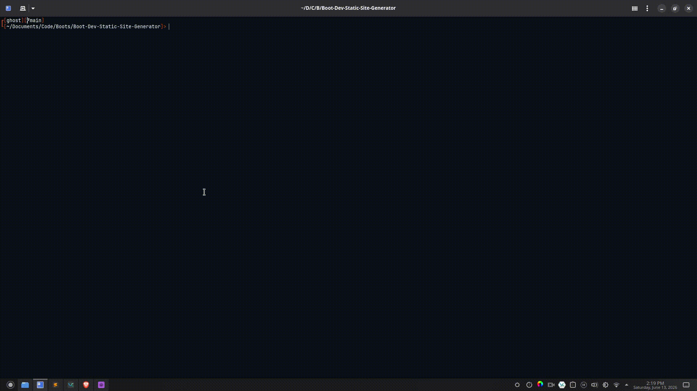

<a id="readme-top"></a>


<div align="center">

<h1 align="center">Static Site Generator</h1>

</div>


<!-- PROJECT LOGO -->
<br />
<div align="center">
  <a href="https://github.com/Hallicon/Boot-Dev-Static-Site-Generator">
    
  </a>

  [![LinkedIn][linkedin-shield]][linkedin-url]

  
</div>


<!-- TABLE OF CONTENTS -->
<details>
  <summary>Table of Contents</summary>
  <ol>
    <li>
      <a href="#about-the-project">About The Project</a>
      <ul>
        <li><a href="#built-with">Built With</a></li>
      </ul>
    </li>
    <li>
      <a href="#getting-started">Getting Started</a>
      <ul>
        <li><a href="#prerequisites">Prerequisites</a></li>
        <li><a href="#installation">Installation</a></li>
      </ul>
    </li>
    <li><a href="#usage">Usage</a></li>
    <li><a href="#contact">Contact</a></li>
    <li><a href="#acknowledgments">Acknowledgments</a></li>
  </ol>
</details>


<!-- ABOUT THE PROJECT -->
## About The Project

[![Product Name Screen Shot][product-screenshot]](https://example.com)

This project was made with a course on the Boot.Dev bootcamp dedicated to it, the purpose of it is to take a collection of markdown files in a `.md` format
and convert them into a fully generated static website with working hyperlinks. While the project was guided, the involvement of the guidance was minimal,
as only instructions on what to do were given, but all the code was written by me.

<p align="right">(<a href="#readme-top">back to top</a>)</p>


### Built With

[![Python][Python]][Python-url]


<p align="right">(<a href="#readme-top">back to top</a>)</p>


<!-- GETTING STARTED -->
## Getting Started

In order to get started, you can host your own web server using the `main.sh` script, doing so will generate html pages from any markdown folders placed in the
`content` directory.

### Prerequisites

This is an example of how to list things you need to use the software and how to install them.
* `Python ver 3.14.5+`:
[Installation Instructions Here][Python-install-url]
* `GNU Bash`: 
[Bash Download][Bash]


### Installation

_Navigate to the root directory of the project. If you have any markdown files, place them as shown in the sample into the `content` folder. Any
related images should be placed inside of the `static/images` directory. Finally if you have any customized CSS formatting it should be copied and 
placed into `static/index.css`. Once you have everything ready, you run the following:_

1. Run `main.sh`
   ```sh
   ./main.sh
   ```
2. Navigate to `http://localhost:8888` on your browser


<p align="right">(<a href="#readme-top">back to top</a>)</p>


<!-- USAGE EXAMPLES -->
## Usage

<div align="center">
	
</div>

<p align="right">(<a href="#readme-top">back to top</a>)</p>


<!-- CONTACT -->
## Contact

My LinkedIn: [Hallicon](https://linkedin.com/in/luky-romero-7482922b5)

Project Link: [Static Website Generator](https://github.com/Hallicon/Boot-Dev-Static-Site-Generator)

<p align="right">(<a href="#readme-top">back to top</a>)</p>


<!-- ACKNOWLEDGMENTS -->
## Acknowledgments

I would like to give thanks to [Boot.Dev Academy][Boots] for this awesome journey!

<p align="right">(<a href="#readme-top">back to top</a>)</p>


<!-- MARKDOWN LINKS & IMAGES -->
<!-- https://www.markdownguide.org/basic-syntax/#reference-style-links -->
[linkedin-shield]: https://img.shields.io/badge/-LinkedIn-black.svg?style=for-the-badge&logo=linkedin&colorB=555
[linkedin-url]: https://www.linkedin.com/in/luky-romero-7482922b5
[product-screenshot]: images/Sample.png
[Python]: https://img.shields.io/badge/Python-3776AB?style=for-the-badge&logo=python&logoColor=white
[Python-url]: https://python.org
[Python-install-url]: https://www.python.org/downloads/
[Bash]: https://ftp.gnu.org/gnu/bash/
[Boots]: https://boot.dev